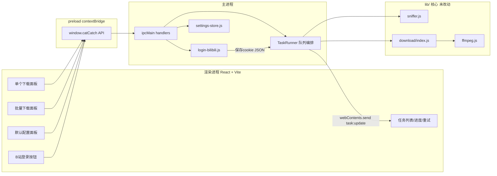

# cat_catch 桌面客户端改造：需求、架构设计与实施问题记录

> 本文档记录将 cat_catch 由纯 CLI 改造为 Electron 桌面应用的完整过程：原始需求、架构设计（与规划阶段的方案完全一致）、以及实施过程中遇到的问题与解决方案。

---

## 一、原始需求

### 1.1 初始需求

cat_catch 项目是一个能够嗅探下载指定 URL 的音视频资源的 CLI 工具，流程已验证通过。需要改造成以 Electron 打包的项目，以便发布给其他人通过 UI 界面使用：

1. 使用 Playwright 嗅探下载的核心方案不用改动，这已经是验证通过的
2. 支持单个 URL 下载嗅探到的资源，URL 支持配置：输出位置、输出的媒体类型（音频还是视频）、是否转码、转码的格式；支持以默认配置直接下载而不是每次都要配置
3. 支持批量下载，批量下载时使用默认配置直接下载（输出位置、媒体类型、是否转码、转码格式）
   - 3.1 批量下载的入口是一个大的文本域，支持空格/回车/换行的方式进行分割
4. 如果嗅探结果没有找到资源，则进行重试，最大次数为 3；因为用户输入的 URL 不一定都有资源
5. 重新设计登录 B 站的交互：Playwright 的 CLI 交互太麻烦，改为在 UI 界面设计一个按钮，以 Electron 的方式直接弹出窗口给用户扫码，然后保存 cookie
6. 每个 URL 下载任务需要显示进度/状态/手动重试

### 1.2 后续澄清与追加需求

- **UI 技术栈**：React + Vite（渲染进程）
- **B 站登录方案**：使用真正的 Electron `BrowserWindow` 弹窗登录（而非 Playwright 窗口），通过 session cookie API 提取后映射注入 Playwright context
- **打包策略**：本地只打包 macOS；macOS/Windows/Linux 三平台安装包通过 GitHub Actions 并行构建，需配置好相关工作流文件
- **依赖版本锁定**：Playwright 强制使用精确版本 `1.49.1`（不用语义化范围），避免自动升级到未经嗅探核心验证过的版本

---

## 二、架构设计

> 本节与规划阶段（implementation plan）产出的架构设计方案完全一致。

### 架构总览



核心约束：`lib/` 目录内所有嗅探/下载算法逻辑（settle 循环、三路嗅探、hook-source、AV 配对、ffmpeg 调用、重试阶梯）**保持原样**，只做两处最小化、向后兼容的新增（不影响 CLI 现有行为）：

1. `lib/sniffer.js` 的 `sniff(url, opts)` 新增可选 `opts.cookies`：`launchPersistentContext` 后若传入则 `await context.addCookies(cookies)` 再 `page.goto`。CLI 不传此参数，行为完全不变。
2. `lib/download/direct.js` 的 `downloadDirect` 新增可选 `opts.onProgress(received, total)` 回调（仿照 `lib/download/segments.js` 已有的 `onProgress` 约定），供 UI 展示字节级进度；不传则行为不变（仍走 `createProgress` 输出到 stderr，CLI 无感）。

---

### 目录结构（新增部分）

```
cat_catch/
├── catch.js                  # 不变，CLI 独立可用
├── lib/                      # 不变（除上述 2 处小增量）
├── electron/
│   ├── main/
│   │   ├── index.js          # app 启动、BrowserWindow、注册 IPC
│   │   ├── task-runner.js    # 任务队列：嗅探(含重试3次)+选取+下载+进度上报
│   │   ├── login-bilibili.js # Electron BrowserWindow 扫码登录 + cookie 提取/保存
│   │   ├── settings-store.js # 默认配置 JSON 持久化（app.getPath('userData')）
│   │   └── ipc-handlers.js   # ipcMain.handle 路由表
│   └── preload/
│       └── index.js          # contextBridge 暴露 window.catCatch
├── src/                      # React 渲染进程（Vite root）
│   ├── main.jsx / App.jsx
│   ├── components/
│   │   ├── SingleDownloadPanel.jsx
│   │   ├── BatchDownloadPanel.jsx
│   │   ├── SettingsPanel.jsx
│   │   ├── LoginButton.jsx
│   │   └── TaskList.jsx / TaskRow.jsx
│   └── styles.css
├── index.html                 # Vite 渲染进程入口
├── electron.vite.config.js
├── electron-builder.yml         # 打包配置（mac/win/linux 三平台 target 定义）
├── .github/
│   └── workflows/
│       └── build.yml            # GitHub Actions：mac/win/linux 矩阵并行打包
└── package.json                # 新增 main 字段 + electron 相关 scripts/依赖
```

技术选型：`electron-vite`（统一驱动 main/preload/renderer 的开发热重载与构建，业界标准搭配）+ React + Vite（用户已选定）；打包用 `electron-builder`。全部保持 JS（不引入 TypeScript），与现有代码风格一致。

---

### 主进程编排：`electron/main/task-runner.js`

维护内存任务队列（浏览器并发上限 2，避免同时开太多 Chromium），单个任务状态机：

```
queued → sniffing → (retrying x≤3，仅当 resources.length===0) → downloading → success
                                                              ↘ failed（可手动重试）
```

关键逻辑（复用 catch.js 里已验证的编排顺序：sniff → 补 headers → pickResources → downloadResources）：

- 嗅探重试：`sniff()` 返回 0 个资源时，最多重试 3 次（间隔小退避）；抛出 `UnsupportedError` 时不重试、直接失败（直播/不支持页面重试无意义）。
- B 站 URL 自动附加已保存 cookie：调用 `sniff(url, { cookies: await loadBilibiliCookies(), ... })`。
- 媒体类型 → 复用 `lib/picker.js` 的 `pickResources`：UI「视频」→ `'best'`（含 B 站音画自动配对/最大资源），「音频」→ `'audio'`。
- 转码开关 → 映射到 `downloadResources` 的 `format`（HLS 用）与 `singleM4sFormat`（单轨 m4s 用）：
  - 关闭转码：`format: 'ts'`, `singleM4sFormat: 'm4s'`（保留原始，不过 B 站音画配对始终会走 `-c copy` 合并封装为 mp4，这是必要的封装步骤而非有损转码，沿用现有 `lib/download/index.js` 逻辑不做例外）
  - 开启转码：`format: 'mp4'`；`singleM4sFormat` 取 UI 选择（音频：`mp3`/`wav`/`m4a`；视频：`mp4`）
- 进度上报：包装 `log` 回调 + 新增的 `onProgress` 透传给 `downloadResources`，通过 `webContents.send('task:update', snapshot)` 推给渲染进程；`snapshot` 含 `{id, url, status, attempt, phase, percent, error, outputFiles}`。
- 手动重试：`retryTask(id)` 重置 attempt 计数与 status，重新入队。

输出目录：默认取 `app.getPath('downloads')/cat_catch`（可在设置面板改）；Playwright 持久化 profile 迁移到 `app.getPath('userData')/catch-profile`（不再锚定项目根，适配打包后只读安装目录）。

---

### B 站扫码登录：`electron/main/login-bilibili.js`

使用**真正的 Electron `BrowserWindow`**弹窗登录，与 Playwright 嗅探解耦：

1. `ipcMain.handle('login:bilibili:start')` 创建一个 `BrowserWindow`（`parent: mainWindow`, `modal: true`, 独立 `session.fromPartition('persist:cat-catch-bilibili-login')`），加载 `https://passport.bilibili.com/login`。
2. 监听该 session 的 `cookies.on('changed', ...)`（或轮询兜底）检测 `SESSDATA` cookie 出现且非空 → 判定登录成功。
3. 登录成功后，取该 session 下 `.bilibili.com` 域全部 cookie，做 Electron→Playwright cookie 格式映射：

```js
function toPlaywrightCookie(c) {
  return {
    name: c.name,
    value: c.value,
    domain: c.domain,
    path: c.path,
    expires: c.session ? -1 : c.expirationDate,
    httpOnly: c.httpOnly,
    secure: c.secure,
    sameSite: { no_restriction: 'None', lax: 'Lax', strict: 'Strict' }[c.sameSite] ?? 'Lax',
  };
}
```

4. 写入 `app.getPath('userData')/bilibili-cookies.json`，关闭登录窗口，向渲染进程推送 `login:status`（`success` / `closed_by_user` / `error`）。
5. `task-runner.js` 在处理 B 站 URL 前读取该文件，通过 `sniff()` 新增的 `opts.cookies` 注入——即前面提到的 `lib/sniffer.js` 唯一的核心增量点：`context.addCookies(cookies)`。
6. 附带「退出登录」：清空 cookie 文件 + 清空该 session partition 的 cookies。
7. 应用启动时检查 cookie 文件是否存在且含非空 `SESSDATA`，用于登录状态角标显示（不校验是否已过期，过期由下次嗅探自然失败后提示用户重新登录）。

---

### 渲染进程 UI（React）

- **顶部**：应用标题 + B 站登录状态角标/按钮（未登录/已登录+退出登录）。
- **Tab 1 单个下载**：URL 输入框 + 「使用默认配置直接下载」开关（默认开）。关闭时展开该次任务的配置表单（输出目录选择、媒体类型单选、转码开关+格式下拉），仅本次生效不覆盖默认配置。
- **Tab 2 批量下载**：一个大文本域，提交时按 `/\s+/`（空格/回车/换行）切分、去重空串，统一使用「默认配置」直接排队下载，无逐条配置入口。
- **默认配置面板**（设置弹层或侧栏，Tab1/Tab2 共用同一份持久化默认值）：输出目录（`dialog.showOpenDialog` 选择）、媒体类型（视频/音频）、是否转码、转码格式（依媒体类型联动选项）。存储于 `electron/main/settings-store.js`（`userData/settings.json`）。
- **任务列表**（贯穿全局，不分 Tab）：每行显示 URL（省略号+ hover 全文）、状态徽章（排队/嗅探中/重试中 N/3/下载中/已完成/失败/未找到资源）、进度条（字节或分片百分比）、操作列（失败/未找到资源时可「手动重试」；成功时可「打开所在文件夹」）。通过 preload 暴露的 `onTaskUpdate(cb)` 订阅 `task:update` 事件驱动重渲染。

---

### IPC 契约（`electron/preload/index.js` 暴露为 `window.catCatch`）

- `getSettings()` / `setSettings(patch)` / `chooseOutputDir()`
- `submitSingle({ url, useDefault, overrideConfig? })`
- `submitBatch({ text })`
- `retryTask({ id })`
- `onTaskUpdate(cb)` → 返回取消订阅函数
- `bilibiliLogin.start()` / `bilibiliLogin.logout()` / `bilibiliLogin.getStatus()` / `bilibiliLogin.onStatus(cb)`

---

### 打包：本地仅 macOS，三平台交给 GitHub Actions

#### 本地打包（本 Mac 环境）

- `package.json` 新增 `"main": "out/main/index.js"`（electron-vite 默认输出目录），scripts：`dev`（`electron-vite dev`）、`build`、`build:mac`。**本地不提供 `build:win`/`build:linux`**（原生依赖跨平台交叉打包不可靠，见下）。
- 本地流程：`playwright install chromium` → `pnpm build` → `pnpm build:mac`，产出 dmg/zip，用于自测验证整体打包链路（图标、`extraResources`、`asar` 排除规则等）跑通。

#### GitHub Actions 三平台矩阵：`.github/workflows/build.yml`

会配置好以下工作流文件，用户后续自行在 GitHub 上触发（如 push tag `v*` 或手动 `workflow_dispatch`）：

```yaml
name: Build
on:
  workflow_dispatch:
  push:
    tags: ['v*']
jobs:
  build:
    strategy:
      matrix:
        include:
          - os: macos-latest
            build_script: build:mac
          - os: windows-latest
            build_script: build:win
          - os: ubuntu-latest
            build_script: build:linux
    runs-on: ${{ matrix.os }}
    steps:
      - uses: actions/checkout@v4
      - uses: pnpm/action-setup@v4
      - uses: actions/setup-node@v4
        with: { node-version: 22, cache: pnpm }
      - run: pnpm install --frozen-lockfile
      - run: pnpm exec playwright install chromium --with-deps
      - run: pnpm build
      - run: pnpm ${{ matrix.build_script }}
      - uses: actions/upload-artifact@v4
        with:
          name: cat_catch-${{ matrix.os }}
          path: dist/*
```

（实现阶段会把 `build:win`、`build:linux` 补回 `package.json` scripts，仅本地默认不主动跑；三者共用同一份 `electron-builder.yml`，各自 target 为 `mac`(dmg/zip)、`win`(nsis)、`linux`(AppImage/deb)。）

#### 已知复杂点（在对应平台的 CI job 内处理，本 Mac 环境无法验证 Windows/Linux 产物）

- **ffmpeg-static**：安装脚本按当前平台下载对应二进制；因此必须在各自目标平台上 `pnpm install`（而非本地交叉打包），CI 矩阵天然满足这一点。
- **Playwright Chromium**：每个 CI job 各自 `playwright install chromium` 得到该平台专属二进制，通过 electron-builder `extraResources` 打进对应安装包；`main/index.js` 启动时设置 `process.env.PLAYWRIGHT_BROWSERS_PATH` 指向 `process.resourcesPath` 下的目录，让最终用户无需联网/无需手动安装即可使用（安装包体积会显著增大，属预期代价）。
- Linux 目标额外注意：Playwright Chromium 在无头 Linux 上通常需要系统依赖库，CI 用 `--with-deps` 参数安装；打包给终端用户时若目标机器缺库，可能需要在 README 里提示或改用 AppImage（自带大部分依赖，优先选用）。

CLI（`catch.js` + `pnpm catch`）保持独立可用，不受 Electron 改造影响。

---

### 实现顺序

1. 脚手架：`electron-vite` + React 初始化，接入现有 `lib/`，跑通「输入URL → 嗅探 → 下载」最小闭环（无 UI 美化）。
2. Task Runner：队列、重试(3次)、进度事件、手动重试。
3. 单个/批量下载面板 + 默认配置面板。
4. B 站登录弹窗 + cookie 注入打通。
5. 任务列表 UI 完善（状态/进度/重试按钮）。
6. electron-builder 打包配置 + 本地 mac 打包验证；配置 `.github/workflows/build.yml`，Windows/Linux（及可重复的 Mac 构建）交由用户在 GitHub Actions 上自行触发验证。

---

## 三、实施过程中遇到的问题

以下问题均在按上述架构落地实现的过程中实际遇到并解决，记录以便后续维护/在其他机器上复现时参考。

### 3.1 Vite 8（Rolldown）与 electron-vite 5 不兼容

- **现象**：`electron-vite build` 主进程打包时报错 `Rolldown failed to resolve import "chromium-bidi/lib/cjs/bidiMapper/BidiMapper"`，`playwright-core` 的整个内部实现被强行内联进主进程 bundle（6MB+ chunk），而不是被当作外部依赖跳过。
- **根因**：`electron-vite@5.0.0` 的 `peerDependencies` 只声明支持 `vite@^5 || ^6 || ^7`；而 `pnpm add -D vite` 默认装到了 `vite@8.2.0`（默认启用 Rolldown 作为打包器），其 `externalizeDepsPlugin` 生成的 `rollupOptions.external`（数组里混了字符串与一个 `RegExp`）在 Rolldown 下没有被正确识别为外部化规则，导致 `import { chromium } from 'playwright'` 被整体打包进去。
- **解决**：将 `vite` 降级到 `^7.3.6`，`@vitejs/plugin-react` 相应降到 `^5.2.0`。降级后 `playwright` 被正确外部化（主进程 bundle 仅 8KB）。

### 3.2 Electron 43 + Node 24（内置）对懒 getter 导出的 ESM 静态分析报错

- **现象**：打包产物运行时报 `SyntaxError: The requested module 'electron' does not provide an export named 'BrowserWindow'`（以及针对 `app`、`ipcMain` 等其他导出的类似报错，报错的具体导出名随导入列表顺序变化，呈"级联"特征）。
- **根因**：Electron 43 内置的 Node.js 版本升级到 v24，其 ESM 加载器对 CommonJS→ESM 的具名导出静态分析更严格；Electron 内置 `electron` 模块里 `BrowserWindow`/`BaseWindow` 等 API 是通过懒 getter 暴露的，不满足新版静态分析的直接赋值模式，导致这些具名导入被判定为"不存在"。此为社区已知问题（对应 `electron/electron#40184`、`wavetermdev/waveterm#3213` 等）。
- **解决**：所有主进程/preload 文件里对 `electron` 的具名导入统一改为命名空间导入再解构：

  ```js
  import * as electron from 'electron';
  const { app, BrowserWindow } = electron;
  ```

  命名空间导入跳过了具名导出的静态分析路径，问题消失。

### 3.3 运行时环境变量 `ELECTRON_RUN_AS_NODE` 残留导致 `app` 为 `undefined`

- **现象**：修复 3.2 后，启动仍报 `TypeError: Cannot read properties of undefined (reading 'isPackaged')`。
- **根因**：测试所用的 shell 会话环境变量里意外残留了 `ELECTRON_RUN_AS_NODE=1`，导致 Electron 进程被强制以"纯 Node 进程"模式启动，跳过了 `browser_init.js` 的正常初始化，`electron` 内置模块退化为空对象。
- **解决**：`unset ELECTRON_RUN_AS_NODE` 后启动即恢复正常（属于测试环境问题，非代码缺陷；正式打包产物不受此影响，Electron Fuses 默认在生产二进制中禁用该环境变量）。

### 3.4 electron-builder 26.15.3 自身的依赖版本 bug

- **现象**：`electron-builder --mac` 在下载 Electron 二进制阶段报错 `Cannot read properties of undefined (reading 'ReadWrite')`，堆栈指向 `app-builder-lib` 的 `electronGet.ts` 里的 `resolveCacheMode()`。
- **根因**：`app-builder-lib@26.15.3` 的源码用到了 `@electron/get@5.x` 才新增的 `ElectronDownloadCacheMode` 枚举，但其 `package.json` 里声明的依赖范围仍是 `@electron/get: ^3.0.0`（上游发布时忘记同步升级依赖范围），pnpm 严格按声明范围解析导致该模块实际链接到 v3，缺少这个枚举。
- **解决**：在 `pnpm-workspace.yaml` 添加 `overrides` 强制整棵依赖树统一使用 `@electron/get@^5.0.0`：

  ```yaml
  overrides:
    '@electron/get': ^5.0.0
  ```

### 3.5 pnpm v11 的 build 脚本白名单迁移

- **现象**：`pnpm install` 报 `[ERR_PNPM_IGNORED_BUILDS]`，`electron`、`ffmpeg-static`、`esbuild`、`electron-winstaller` 的 postinstall 脚本（下载二进制）被跳过，导致 `electron` 缺少真实二进制、`ffmpeg-static` 缺少 ffmpeg 可执行文件。
- **根因**：pnpm 近期版本默认阻止依赖的构建脚本执行（供应链安全策略），需显式在 `pnpm-workspace.yaml` 的 `onlyBuiltDependencies` 里加白名单。
- **解决**：

  ```yaml
  onlyBuiltDependencies:
    - ffmpeg-static
    - electron
    - electron-winstaller
    - esbuild
  ```

### 3.6 测试主机 macOS 版本过旧，无法下载最新 Playwright Chromium

- **现象**：`playwright install chromium` 报 `ERROR: Playwright does not support chromium on mac12`。
- **根因**：测试所用 Mac 系统版本为 macOS 12.7.6（Monterey），而 `playwright@1.49.1` 对应的 Chromium 构建已不再提供 macOS 12 的下载包。
- **结论**：这是**测试环境限制**，不是代码缺陷——目标发布机器（用户自己的较新 macOS）、以及 GitHub Actions 的 `macos-latest` runner（macOS 14+）均不受影响。已在本地用 `electron-builder --mac --dir`（跳过真实 Chromium 下载，仅放置占位目录）单独验证过打包结构（`asar`、`asarUnpack`、`extraResources` 均正确生成）。

### 3.7 Playwright 版本锁定

- **需求变更**：嗅探核心已在 `1.49.1` 上验证通过，要求强制锁定该版本，不随语义化版本范围自动升级（默认曾被 pnpm 解析到 `1.62.1`）。
- **解决**：
  - `package.json` 里 `playwright` 依赖从 `^1.49.1` 改为精确版本 `1.49.1`
  - `pnpm-workspace.yaml` 的 `overrides` 里同时锁定 `playwright` 与 `playwright-core` 到 `1.49.1`，防止其他依赖间接拉取到不同版本

---

## 四、验证情况

- `electron-vite build` 三个产物（main/preload/renderer）均构建成功，`playwright` 在主进程 bundle 中被正确外部化
- `electron .` 开发模式启动成功，React 界面完整渲染（标题、登录角标、单个/批量下载面板、任务列表等），`window.catCatch` 预加载 API 正确暴露
- 实际提交过一个真实 B 站 URL 进行了端到端验证：任务入队 → 嗅探重试 → 失败时错误信息正确回显到任务列表；B 站扫码登录弹窗正常打开
- `electron-builder --mac --dir` 打包结构验证通过：`app.asar` / `app.asar.unpacked`（ffmpeg-static 二进制正确解包）/ `extraResources/playwright-browsers` 均生成正确
- CLI 原有行为（`node catch.js --help` 等）未受影响，回归验证通过
- `.github/workflows/build.yml` 的 YAML 语法已用 `js-yaml` 校验通过
